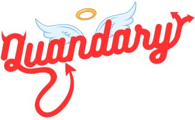

###  About Me :

<h1>

  <picture>
  <source media="(prefers-color-scheme: dark)" srcset="https://res.cloudinary.com/drfmymoki/image/upload/v1679768056/hi_darkmode_sagy7h.svg" />
  <source media="(prefers-color-scheme: light)" srcset="https://res.cloudinary.com/drfmymoki/image/upload/v1679768056/hi_lightmode_zyyov7.svg" />
  
</picture>

</h1>

<h3>I'm a recent graduate of    Le Wagon on my way to becoming a Full Stack Developer!</h3>

 I’m currently working on   - A Game of Absurd Dilemmas

<h3>The rest of the Quandary team:</h3>

- [Nina Lodeiro](https://github.com/jnlnina)
- [Jerome MR](https://github.com/Assasquid)
- [Cristian Führich](https://github.com/fuehrichuk)

<h2> :mailbox: Connect with me:</h2>
  

<h1></h1>

### :hammer_and_wrench: Some Tools I've Used:
<h1>

  

</h1>

🌱 I'm Currently Learning:
<h1>

  

</h1>

  <picture>
  <source media="(prefers-color-scheme: dark)" srcset="https://res.cloudinary.com/drfmymoki/image/upload/v1679618289/github-user-contribution_fg1pol.svg" />
  <source media="(prefers-color-scheme: light)" srcset="https://res.cloudinary.com/drfmymoki/image/upload/v1679618356/github-user-contribution_1_xfp3ny.svg" />
  
</picture>

### :fire: My Stats :
  

  

    <picture>
      <source
        srcset="https://github-readme-stats.vercel.app/api?username=willo3&show_icons=true&theme=dark"
        media="(prefers-color-scheme: dark)"
      />
      <source
        srcset="https://github-readme-stats.vercel.app/api?username=willo3&show_icons=true"
        media="(prefers-color-scheme: light), (prefers-color-scheme: no-preference)"
      />
      
    </picture>
  

  

    
  

<!--
**willo3/willo3** is a ✨ _special_ ✨ repository because its `README.md` (this file) appears on your GitHub profile.

Here are some ideas to get you started:

- 🔭 I’m currently working on ...
- 🌱 I’m currently learning ...
- 👯 I’m looking to collaborate on ...
- 🤔 I’m looking for help with ...
- 💬 Ask me about ...
- 📫 How to reach me: ...
- 😄 Pronouns: ...
- ⚡ Fun fact: ...
-->
